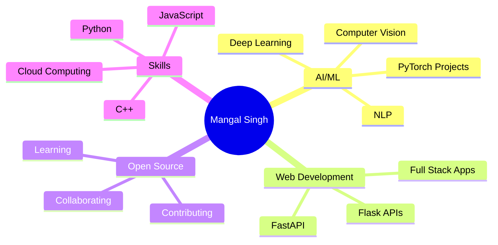

<!-- Animated Header Banner -->


<!-- Typing SVG Animation -->
<div align="center">
  
</div>

<!-- Animated Snake -->
<picture>
  <source media="(prefers-color-scheme: dark)" srcset="https://raw.githubusercontent.com/platane/snk/output/github-contribution-grid-snake-dark.svg">
  <source media="(prefers-color-scheme: light)" srcset="https://raw.githubusercontent.com/platane/snk/output/github-contribution-grid-snake.svg">
  
</picture>

<br/>

## 🚀 About Me

```python
class MangalSingh:
    def __init__(self):
        self.name = "Mangal Singh"
        self.role = "AI/ML Engineer & Full Stack Developer"
        self.location = "Indore, India 🇮🇳"
        self.education = "Computer Science Student"
        
    def current_work(self):
        return {
            "focus": ["PyTorch", "Deep Learning", "Neural Networks"],
            "learning": ["Flask", "FastAPI", "MLOps"],
            "interests": ["Computer Vision", "NLP", "Reinforcement Learning"]
        }
    
    def collaborate_on(self):
        return ["AI/ML Projects", "Open Source", "Research Papers"]
    
    def fun_fact(self):
        return "I debug with print statements and I'm not ashamed! 🐛"

me = MangalSingh()
```

<br/>

## 🌐 Connect With Me

<div align="center">
  <a href="mailto:livingmangalsingh.02@gmail.com">
    
  </a>
  <a href="https://www.linkedin.com/in/mangalsinghr/" target="_blank">
    
  </a>
  <a href="https://github.com/livingmangal" target="_blank">
    
  </a>
  <a href="https://twitter.com/livingmangal" target="_blank">
    
  </a>
</div>

<br/>

## 💻 Tech Arsenal

<div align="center">

### 🔥 Languages


### 🤖 AI/ML & Data Science


### 🌐 Web Development


### 🗄️ Databases


### ☁️ Cloud & DevOps


### 🛠️ Tools & Technologies


</div>

<br/>

<!-- Animated Divider -->


<br/>

## 📊 GitHub Analytics

<div align="center">


</div>


<br/>

<!-- Animated Divider -->


<br/>

## 📈 Contribution Graph

<div align="center">
  
</div>

<br/>

## 💡 Random Dev Quote

<div align="center">
  
</div>

<br/>

## 🔝 Top Contributed Repositories

<div align="center">

<!-- Fallback (always visible) -->


<!-- Live card (may or may not load) -->


</div>


<br/>

<!-- Animated Divider -->


<br/>

## 🎯 Current Focus

<div align="center">



</div>

<br/>

## 📫 Let's Collaborate!

<div align="center">
  
I'm always interested in working on innovative projects, especially those involving:
- 🤖 **Artificial Intelligence & Machine Learning**
- 🧠 **Deep Learning & Neural Networks**
- 👁️ **Computer Vision Applications**
- 💬 **Natural Language Processing**
- 🌐 **Full Stack Development**
- 🔓 **Open Source Contributions**

**Feel free to reach out if you want to collaborate or just chat about tech!**

</div>

<br/>

## 📊 Profile Views

<div align="center">
  
</div>

<br/>

<!-- Animated Divider -->


<!-- Footer Banner -->


<div align="center">
  
</div>
