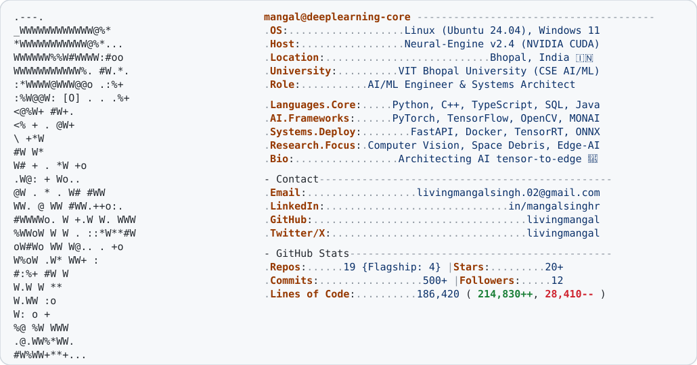
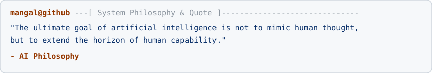

<!-- Animated Header Banner -->

  

<!-- Typing SVG Animation -->

  

 

<!-- Neofetch Terminal Profile Card (Dual Theme Dark/Light) -->

  <a href="https://github.com/livingmangal">
    <picture>
      <source media="(prefers-color-scheme: dark)" srcset="./dark_mode_v5.svg">
      
    </picture>
  </a>

 

<!-- Social & Connect Hub -->
<table align="center" width="100%">
  <tr>
    <td align="center" width="16%">
      
    </td>
    <td align="center" width="16%">
      
    </td>
    <td align="center" width="16%">
      
    </td>
    <td align="center" width="16%">
      
    </td>
    <td align="center" width="16%">
      
    </td>
    <td align="center" width="16%">
      
    </td>
  </tr>
</table>

 

<!-- Animated Divider -->

 

## 💀 Skills &amp; Stacks Arsenal

<table>
  <tr>
    <td width="80" align="center">
       &nbsp;&nbsp;&nbsp;&nbsp;&nbsp;&nbsp;&nbsp;&nbsp;&nbsp;&nbsp;&nbsp;&nbsp;&nbsp;&nbsp;&nbsp;
    </td>
    <td width="80" align="center">
       &nbsp;&nbsp;&nbsp;&nbsp;&nbsp;&nbsp;&nbsp;&nbsp;&nbsp;&nbsp;&nbsp;&nbsp;&nbsp;&nbsp;&nbsp;
    </td>
    <td width="80" align="center">
       &nbsp;&nbsp;&nbsp;&nbsp;&nbsp;&nbsp;&nbsp;&nbsp;&nbsp;&nbsp;&nbsp;&nbsp;&nbsp;&nbsp;&nbsp;
    </td>
    <td width="80" align="center">
       &nbsp;&nbsp;&nbsp;&nbsp;&nbsp;&nbsp;&nbsp;&nbsp;&nbsp;&nbsp;&nbsp;&nbsp;&nbsp;&nbsp;&nbsp;
    </td>
    <td width="80" align="center">
       &nbsp;&nbsp;&nbsp;&nbsp;&nbsp;&nbsp;&nbsp;&nbsp;&nbsp;&nbsp;&nbsp;&nbsp;&nbsp;&nbsp;&nbsp;
    </td>
    <td width="80" align="center">
       &nbsp;&nbsp;&nbsp;&nbsp;&nbsp;&nbsp;&nbsp;&nbsp;&nbsp;&nbsp;&nbsp;&nbsp;&nbsp;&nbsp;&nbsp;
    </td>
    <td width="80" align="center">
       &nbsp;&nbsp;&nbsp;&nbsp;&nbsp;&nbsp;&nbsp;&nbsp;&nbsp;&nbsp;&nbsp;&nbsp;&nbsp;&nbsp;&nbsp;
    </td>
    <td width="80" align="center">
       &nbsp;&nbsp;&nbsp;&nbsp;&nbsp;&nbsp;&nbsp;&nbsp;&nbsp;&nbsp;&nbsp;&nbsp;&nbsp;&nbsp;&nbsp;
    </td>
    <td width="80" align="center">
       &nbsp;&nbsp;&nbsp;&nbsp;&nbsp;&nbsp;&nbsp;&nbsp;&nbsp;&nbsp;&nbsp;&nbsp;&nbsp;&nbsp;&nbsp;
    </td>
    <td width="80" align="center">
       &nbsp;&nbsp;&nbsp;&nbsp;&nbsp;&nbsp;&nbsp;&nbsp;&nbsp;&nbsp;&nbsp;&nbsp;&nbsp;&nbsp;&nbsp;
    </td>
    <td width="80" align="center">
       &nbsp;&nbsp;&nbsp;&nbsp;&nbsp;&nbsp;&nbsp;&nbsp;&nbsp;&nbsp;&nbsp;&nbsp;&nbsp;&nbsp;&nbsp;
    </td>
    <td width="80" align="center">
       &nbsp;&nbsp;&nbsp;&nbsp;&nbsp;&nbsp;&nbsp;&nbsp;&nbsp;&nbsp;&nbsp;&nbsp;&nbsp;&nbsp;&nbsp;
    </td>
  </tr>
  <tr>
    <td width="80" align="center">
      
    </td>
    <td width="80" align="center">
      
    </td>
    <td width="80" align="center">
      
    </td>
    <td width="80" align="center">
      
    </td>
    <td width="80" align="center">
      
    </td>
    <td width="80" align="center">
      
    </td>
    <td width="80" align="center">
      
    </td>
    <td width="80" align="center">
      
    </td>
    <td width="80" align="center">
      
    </td>
    <td width="80" align="center">
      
    </td>
    <td width="80" align="center">
      
    </td>
    <td width="80" align="center">
      
    </td>
  </tr>
  <tr>
    <td width="80" align="center">
      
    </td>
    <td width="80" align="center">
      
    </td>
    <td width="80" align="center">
      
    </td>
    <td width="80" align="center">
      
    </td>
    <td width="80" align="center">
      
    </td>
    <td width="80" align="center">
      
    </td>
    <td width="80" align="center">
      
    </td>
    <td width="80" align="center">
      
    </td>
    <td width="80" align="center">
      
    </td>
    <td width="80" align="center">
      
    </td>
    <td width="80" align="center">
      
    </td>
    <td width="80" align="center">
      
    </td>
  </tr>
  <tr>
    <td width="80" align="center">
      
    </td>
    <td width="80" align="center">
      
    </td>
    <td width="80" align="center">
      
    </td>
    <td width="80" align="center">
      
    </td>
    <td width="80" align="center">
      
    </td>
    <td width="80" align="center">
      
    </td>
    <td width="80" align="center">
      
    </td>
    <td width="80" align="center">
      
    </td>
    <td width="80" align="center">
      
    </td>
    <td width="80" align="center">
      
    </td>
    <td width="80" align="center">
      
    </td>
    <td width="80" align="center">
      
    </td>
  </tr>
  <tr>
    <td width="80" align="center">
      
    </td>
    <td width="80" align="center">
      
    </td>
    <td width="80" align="center">
      
    </td>
    <td width="80" align="center">
      
    </td>
    <td width="80" align="center">
      
    </td>
    <td width="80" align="center">
      
    </td>
    <td width="80" align="center">
      
    </td>
    <td width="80" align="center">
      
    </td>
    <td width="80" align="center">
      
    </td>
    <td width="80" align="center">
      
    </td>
    <td width="80" align="center">
      
    </td>
    <td width="80" align="center">
      
    </td>
  </tr>
  <tr>
    <td width="80" align="center">
      
    </td>
    <td width="80" align="center">
      
    </td>
    <td width="80" align="center">
      
    </td>
    <td width="80" align="center">
      
    </td>
    <td width="80" align="center">
      
    </td>
    <td width="80" align="center">
      
    </td>
    <td width="80" align="center">
      
    </td>
    <td width="80" align="center">
      
    </td>
    <td width="80" align="center">
      
    </td>
    <td width="80" align="center">
      
    </td>
    <td width="80" align="center">
      
    </td>
    <td width="80" align="center">
      
    </td>
  </tr>
  <tr>
    <td width="80" align="center">
      
    </td>
    <td width="80" align="center">
      
    </td>
    <td width="80" align="center">
      
    </td>
    <td width="80" align="center">
      
    </td>
    <td width="80" align="center">
      
    </td>
    <td width="80" align="center">
      
    </td>
    <td width="80" align="center">
      
    </td>
    <td width="80" align="center">
      
    </td>
    <td width="80" align="center">
      
    </td>
    <td width="80" align="center">
      
    </td>
    <td width="80" align="center">
      
    </td>
    <td width="80" align="center">
      
    </td>
  </tr>
</table>

> *Trained on high-dimensional data, accelerated with CUDA kernels, and architected for mission-critical deployment.*

 

<!-- Animated Divider -->

 

## 📂 Featured Engineering &amp; Research Projects

<table align="center" style="border: none;" width="100%">
  <tr>
    <td width="280" valign="top" align="center">
      
        
      
    </td>
    <td width="820" valign="top">
      <picture>
        <source media="(prefers-color-scheme: dark)" srcset="./projects_dark_v1.svg?v=3">
        
      </picture>
    </td>
  </tr>
</table>

| 🚀 Project | 🏷️ Domain | 🛠️ Tech Stack | 🔗 Repository |
| :--- | :--- | :--- | :--- |
| **Synapse-OS** | Public Health AI Orchestrator | TypeScript • PyTorch • MONAI • YOLOv8 • Polygon | [View Project →](https://github.com/livingmangal/Synapse-OS) |
| **Cosmic Recycler** | Space Debris ML & Recycling (MDPI) | Python • OpenCV • YOLO • TLE Trajectory | [View Project →](https://github.com/livingmangal/debris_app) |
| **Edge-AI Earthquake** | Autonomous Seismic Warning Mesh | Python • FastAPI • Edge AI • PyTorch | [View Project →](https://github.com/livingmangal/Edge-AI-Earthquake-Detection-Project) |
| **PostureAI** | Computer Vision Ergonomics | JavaScript • MediaPipe • React • Node.js | [View Project →](https://github.com/livingmangal/PostureAI-Hackathon) |

 

<!-- Animated Divider -->

 

## 🧠 End-to-End AI &amp; Systems Architecture

```mermaid
graph LR
    subgraph Data["1. Data &amp; Telemetry Ingestion"]
        D1[Raw TLE Orbit Data] --> D2[Feature Extraction &amp; Preprocessing]
        D3[Clinical Radiography / DICOM] --> D2
        D4[Seismic Accelerometer Stream] --> D2
    end

    subgraph Modeling["2. Deep Learning &amp; Neural Compute"]
        D2 --> M1[PyTorch CUDA Kernels]
        M1 --> M2[YOLOv8 Object Detection]
        M1 --> M3[MONAI Biomedical Segmentation]
        M1 --> M4[Edge Recurrent Classifiers]
    end

    subgraph Optimization["3. Optimization &amp; Quantization"]
        M2 & M3 & M4 --> O1[ONNX Graph Serialization]
        O1 --> O2[TensorRT INT8 / FP16 Engine]
        O2 --> O3[Latency &lt; 15ms Profiling]
    end

    subgraph Serving["4. Edge &amp; Cloud Deployment"]
        O3 --> S1[FastAPI Asynchronous Microservices]
        S1 --> S2[Docker Containerized Mesh]
        S2 --> S3[WhatsApp/SMS Omnichannel Bot]
        S2 --> S4[Autonomous Edge Microcontrollers]
    end

    style Data fill:#161b22,stroke:#58a6ff,stroke-width:1.5px,color:#c9d1d9
    style Modeling fill:#161b22,stroke:#bc8cff,stroke-width:1.5px,color:#c9d1d9
    style Optimization fill:#161b22,stroke:#f0883e,stroke-width:1.5px,color:#c9d1d9
    style Serving fill:#161b22,stroke:#3fb950,stroke-width:1.5px,color:#c9d1d9
```

 

<!-- Animated Divider -->

 

## ⏱️ AI &amp; Engineering Activity Metrics

  <picture>
    <source media="(prefers-color-scheme: dark)" srcset="./hackatime_dark_v1.svg?v=3">
    
  </picture>

 

## 📈 3D Contribution Graph

  <picture>
    <source media="(prefers-color-scheme: dark)" srcset="./profile-3d-contrib/profile-night-rainbow.svg?v=6">
    
  </picture>

 

<!-- Animated Divider -->

 

## 📊 GitHub Live Analytics

<table align="center" style="border: none;">
  <tr>
    <td align="center" valign="middle">
      
    </td>
    <td align="center" valign="middle">
      
    </td>
  </tr>
</table>

 

## 🐍 Contribution Grid Snake

  <picture>
    <source media="(prefers-color-scheme: dark)" srcset="https://raw.githubusercontent.com/livingmangal/livingmangal/output/github-snake-dark.svg">
    <source media="(prefers-color-scheme: light)" srcset="https://raw.githubusercontent.com/livingmangal/livingmangal/output/github-snake.svg">
    
  </picture>

 

<!-- Animated Divider -->

 

## ✍️ Random Dev Quote

  <picture>
    <source media="(prefers-color-scheme: dark)" srcset="./quote_dark_v1.svg">
    
  </picture>

 

## 🤝 Let's Collaborate &amp; Build

I am always keen to collaborate on forward-thinking research initiatives and high-performance engineering projects:
- 🧠 **Deep Learning Architectures &amp; Distributed Training**
- 👁️ **Computer Vision, Segmentation &amp; Visual Telemetry**
- 🛰️ **Space Tech, Orbital Tracking &amp; Scientific ML**
- ⚡ **Edge AI, TensorRT Ingestion &amp; Low-Latency Inference**
- 🌐 **Scalable Full-Stack Systems &amp; Healthcare AI Engines**

**Open for open-source contributions, research collaborations, and engineering discussions.**

 

<!-- Profile Views Counter -->

  

 

<!-- Animated Footer Wave Banner -->

  

  

